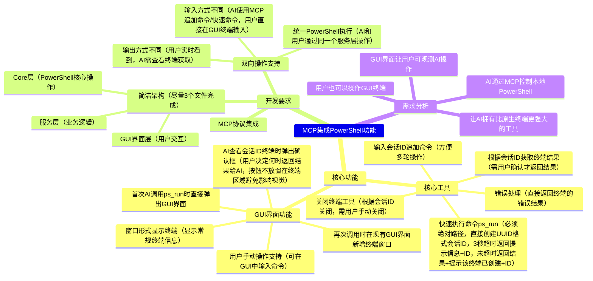
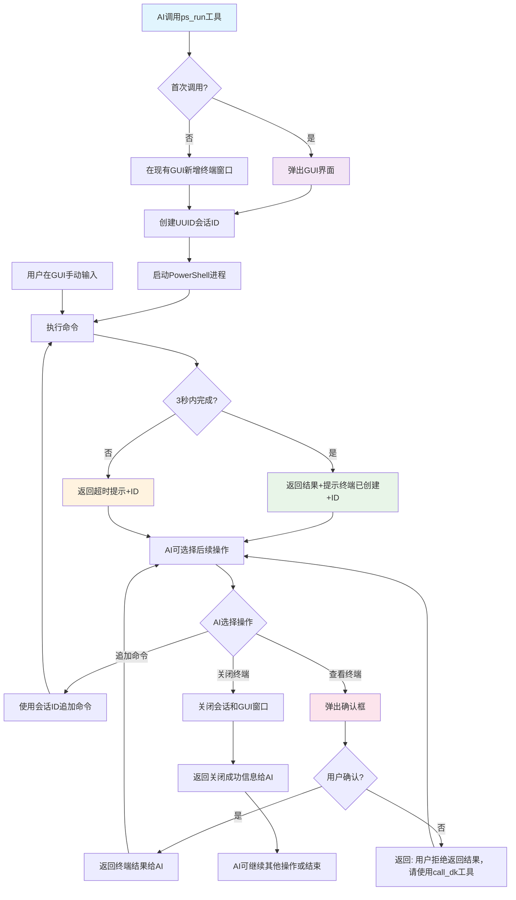

## 项目核心功能与目标 (内容用mindmap编写)

## 用户环境及硬件及技术栈(内容用markdown编写)
### 用户环境
- **操作系统**: Windows 10
- **PowerShell版本**: PowerShell 7
- **PowerShell路径**: `C:\Program Files\PowerShell\7`
### 技术栈
- **编程语言**: Python 3.8+
- **MCP框架**: FastMCP (官方Python SDK)
- **GUI框架**: CustomTkinter (现代化tkinter)
- **PowerShell集成**: subprocess + asyncio
- **会话管理**: UUID + 内存字典存储

## 项目流程图 (内容用mermaid编写)


## 目录结构(内容用markdown编写)

### 当前实际目录结构
```
ai-tool-mcp/
├── LICENSE                    # 许可证文件
├── README.md                  # 项目说明文档
├── mcp.json                   # MCP配置文件
├── server.py                  # MCP服务器入口（文件操作、下载、系统监控工具）
├── 核心.md                    # 项目核心文档
├── core/                      # 核心功能模块
│   ├── __init__.py            # 模块初始化
│   ├── config.py              # 配置管理（日志、路径等配置）
│   ├── file_downloader.py     # 文件下载器（HTTP下载、验证）
│   ├── file_option.py         # 文件操作（读写、复制、移动、删除）
│   ├── path_validator.py      # 路径验证（安全性检查）
│   └── system_monitor.py      # 系统监控（系统信息获取）
├── services/                  # 服务层
│   ├── __init__.py            # 模块初始化
│   ├── base_service.py        # 基础服务类（通用服务基类）
│   ├── download_service.py    # 下载服务（下载业务逻辑）
│   ├── file_service.py        # 文件服务（文件操作业务逻辑）
│   └── system_service.py      # 系统服务（系统监控业务逻辑）
└── logs/                      # 日志目录
    ├── ai-tool.log            # AI工具日志
    ├── gui.log                # GUI操作日志
    └── test.log               # 测试日志
```

### 集成PowerShell功能后的目录结构
```
ai-tool-mcp/
├── LICENSE                    # 许可证文件
├── README.md                  # 项目说明文档
├── mcp.json                   # MCP配置文件
├── server.py                  # 📝 MCP服务器入口（文件操作+下载+系统监控+PowerShell工具）
├── 核心.md                    # 项目核心文档
├── core/                      # 核心功能模块
│   ├── __init__.py            # 模块初始化
│   ├── config.py              # 配置管理（日志、路径等配置）
│   ├── file_downloader.py     # 文件下载器（HTTP下载、验证）
│   ├── file_option.py         # 文件操作（读写、复制、移动、删除）
│   ├── path_validator.py      # 路径验证（安全性检查）
│   ├── system_monitor.py      # 系统监控（系统信息获取）
│   └── powershell_core.py     # 🆕 PowerShell核心操作层（subprocess+asyncio执行）
├── services/                  # 服务层
│   ├── __init__.py            # 模块初始化
│   ├── base_service.py        # 基础服务类（通用服务基类）
│   ├── download_service.py    # 下载服务（下载业务逻辑）
│   ├── file_service.py        # 文件服务（文件操作业务逻辑）
│   ├── system_service.py      # 系统服务（系统监控业务逻辑）
│   ├── powershell_service.py  # 🆕 PowerShell服务层（会话管理+UUID+用户确认逻辑）
│   └── powershell_gui.py      # 🆕 GUI界面层（CustomTkinter终端界面+用户交互）
└── logs/                      # 日志目录
    ├── ai-tool.log            # AI工具日志
    ├── gui.log                # GUI操作日志
    └── test.log               # 测试日志
```

### 新增文件说明
- **🆕 core/powershell_core.py**: 核心层，封装PowerShell进程操作、命令执行、结果获取
- **🆕 services/powershell_service.py**: 服务层，处理会话管理、UUID生成、用户确认逻辑
- **🆕 services/powershell_gui.py**: GUI界面层，使用CustomTkinter创建终端显示界面
- **📝 server.py**: 需要集成新的PowerShell工具（ps_run、获取结果、追加命令、关闭终端）
